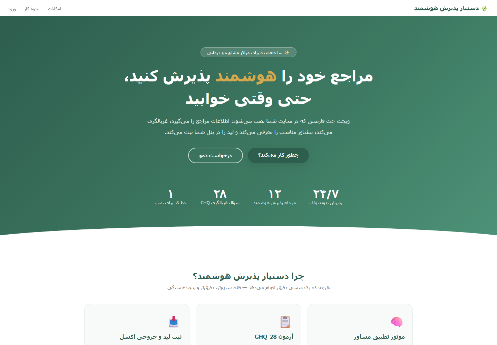
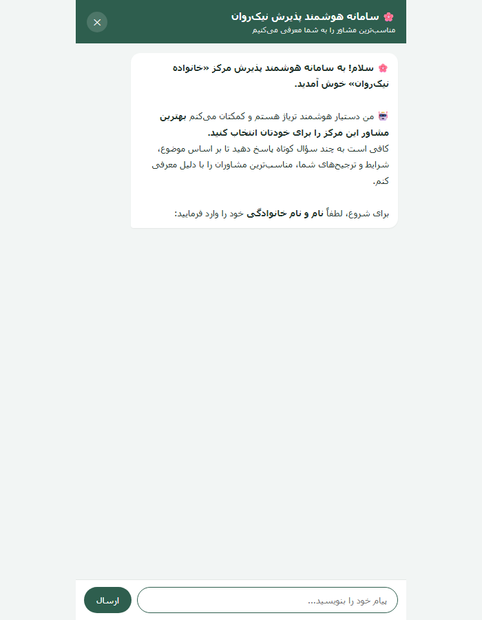

<p align="center">
  
</p>

<h1 align="center">Nikravan AI Widget</h1>

<p align="center">
  <b>Multi-tenant Persian RTL chat widget for counseling centers and clinics.</b><br>
  Every tenant gets an API key and an admin panel, drops one <code>&lt;script&gt;</code> tag on their site,
  and sees their own conversations and leads.
</p>

<p align="center">
  <a href="https://github.com/Mohammad-Hasan-Kaman/nikravan-widget-backup/blob/main/LICENSE"></a>
  
  
  
  
  <a href="https://github.com/Mohammad-Hasan-Kaman/nikravan-widget-backup/stargazers"></a>
</p>

<p align="center">
  <a href="#-quick-start">Quick start</a> ·
  <a href="#-embed-on-a-tenant-site">Embed</a> ·
  <a href="#-api">API</a> ·
  <a href="#-admin-panel">Admin panel</a> ·
  <a href="#-matching-engine">Matching engine</a> ·
  <a href="#-deployment">Deployment</a>
</p>

---

## Highlights

| | |
|---|---|
| **One-line embed** | A single `<script>` tag with a per-tenant `nk_…` API key. No build step, no SDK. |
| **Multi-tenant by design** | API keys, admin accounts, allowed domains, conversation flows and consultant data are all scoped per tenant. |
| **Configurable flow** | Welcome message → numbered steps (text / phone / number / choice) → GHQ-28 screening → outcome. Edited live from the panel, no redeploy. |
| **GHQ-28 screening** | 28 questions across four subscales (somatic, anxiety, social, depression), scored and interpreted server-side. |
| **Lead capture that never drops** | A request is persisted *before* the matching step, so a user who needs a consultant is always recorded — even when no match is found. |
| **Self-learning matching** | Per-tenant concept weights updated from success/failure feedback; profile cache is thread-safe and tenant-isolated. |
| **Availability crawler** | Background crawler pulls open appointment slots every 2 hours (on by default; toggle with `CRAWLER_ENABLED`). |
| **Demo per tenant** | Each tenant gets a shareable `/demo/{api_key}` page to try the widget live. |
| **Persian-first UI** | Full RTL layout and Persian formatting in both the widget and the panel. |

## Screenshots

| Landing page | Chat widget |
|---|---|
|  |  |

## Quick start

```bash
git clone https://github.com/Mohammad-Hasan-Kaman/nikravan-widget-backup.git
cd nikravan-widget-backup

python -m venv .venv
# Linux/macOS:  source .venv/bin/activate
# Windows:      .venv\Scripts\activate
pip install -r requirements.txt

cp .env.example .env      # Windows: copy .env.example .env
# Fill in SECRET_KEY, SUPER_ADMIN_PASSWORD, ADMIN_PANEL_PASSWORD (see .env.example)

uvicorn app.main:app --host 0.0.0.0 --port 8000
```

Then open:

| URL | Purpose |
|-----|---------|
| `/` | Product landing page |
| `/widget?key=nk_…` | The chat widget (standalone) |
| `/demo/{api_key}` | Shareable live demo for one tenant |
| `/admin` | Admin panel (super admin / tenant admin) |
| `/api/chat/health` | Health check → `{"status":"ok"}` |

> The database is created and seeded automatically on first boot — no migration step is needed.

## Embed on a tenant site

```html
<script
  src="https://WIDGET_HOST/static/widget.js"
  data-origin="https://WIDGET_HOST"
  data-key="nk_xxxxxxxx"
  async
></script>
```

`data-origin` must be the widget host itself, and the hosting domain should be listed in the
tenant's **allowed domains** (set by the super admin) plus in `CORS_ORIGINS`.

## API

| Method | Endpoint | Auth | Description |
|--------|----------|------|-------------|
| `GET`  | `/api/chat/health` | — | Liveness probe |
| `POST` | `/api/chat/session` | API key | Create or resume a widget session |
| `POST` | `/api/chat/message` | session token | Send one message, get the next flow step |

Rate limits: **30 requests/minute** per client IP + session token, and
**10 failed login attempts / 5 minutes** per IP (anti brute-force).

## Admin panel

**Tenant admin** (`/admin`)

- 📊 **Dashboard** — user / request / conversation stats, appointment-slot status, API key + embed code
- 💬 **Conversations** — full transcript of every chat
- 📥 **Requests** — lead table with Persian Excel export
- 📣 **Announcement** — broadcast message shown on the next widget open
- ⚙️ **Flow editor** — welcome text, steps, GHQ-28, outcome (recommend a consultant or capture a lead)
- 👥 **Consultants** — active Excel roster (view / preview / download), upload new, data-validity report
- 🧠 **Feedback & learning** — success/failure feedback plus the engine's live weight table
- 🔄 **Availability crawl** — status and trigger for the background crawler

**Super admin** — create tenants, issue / rotate API keys, reset passwords, manage allowed domains,
enable/disable tenants, add tenant admins, change own password.

## Matching engine

`SpiralMatchEngine` (`app/internal_ai_engine.py`):

1. **Filters** — gender, branch/city, age, session type
2. **Concept extraction** — clinical concepts detected from the free-text message
3. **GHQ context** — screening results weight the recommendation
4. **Availability** — open appointment slots pulled by the crawler
5. **Learning weights** — per-tenant weights updated from panel feedback

Profiles are loaded once and cached per tenant behind a lock, with no shared global state,
so one tenant's data can never leak into another's match results.

## Architecture

```
app/
├── main.py                  FastAPI app, security headers, scheduler, page routes
├── config.py                Env-based configuration (.env)
├── db.py                    SQLite init + hourly garbage collection
├── auth.py                  PBKDF2 password hashing, signed session cookies (4 h TTL)
├── tenants.py               Tenants, API keys, seed data, default flow
├── session_store.py         Per-tenant flow engine (steps, GHQ, lead capture)
├── internal_ai_engine.py    SpiralMatchEngine — per-tenant cache + learning weights
├── ghq_analyzer.py          GHQ-28 scoring (4 subscales)
├── crawler.py               Availability crawler (every 2 h)
├── excel_to_json.py         Consultant Excel → JSON profiles
├── admin_tools.py           Persian Excel export
└── routers/
    ├── chat.py              Public chat API (API key + rate limit + announcement)
    └── admin.py             Admin panel + super-admin endpoints
static/                      landing.html · demo.html · widget.js / widget.html / widget-app.js
flows/                       JSON flow definitions per tenant
data/                        SQLite DBs + consultant JSON (git-ignored)
```

## Security

- **Passwords** — PBKDF2-HMAC-SHA256, 100 000 iterations, per-user random salt
- **Sessions** — signed, time-limited cookies (`itsdangerous`), 4 h for the panel, 24 h for widget sessions
- **Rate limiting** — 30 msg/min/session, 10 login attempts/5 min/IP
- **CORS** — explicit origin allow-list from `CORS_ORIGINS` (never `*`)
- **Headers** — `X-Content-Type-Options: nosniff`, `X-Frame-Options: SAMEORIGIN` (relaxed only for `/widget` so it can be embedded)
- **Tenant isolation** — domain allow-list per tenant, API-key scoped queries, tenant-scoped caches
- **Input limits** — 2 000 characters per message, Persian phone-number validation
- **No secrets in the repo** — `.env` is git-ignored; only `.env.example` placeholders are committed

## Deployment

Docker and docker-compose are included. Full production guide (Nginx reverse proxy, HTTPS,
backups, security checklist): **[DEPLOY.md](DEPLOY.md)**.

```bash
docker compose up -d --build
curl http://127.0.0.1:8000/api/chat/health   # {"status":"ok"}
```

## Requirements

- Python 3.11+
- See [`requirements.txt`](requirements.txt) — FastAPI, Uvicorn, Jinja2, pandas/openpyxl,
  APScheduler, BeautifulSoup4, httpx, itsdangerous
- No external database or third-party AI service required — matching runs locally

## Contributing

Contributions are welcome — see [CONTRIBUTING.md](CONTRIBUTING.md).

## Changelog

See [CHANGELOG.md](CHANGELOG.md) for release history.

## License

Released under the [MIT License](LICENSE).
